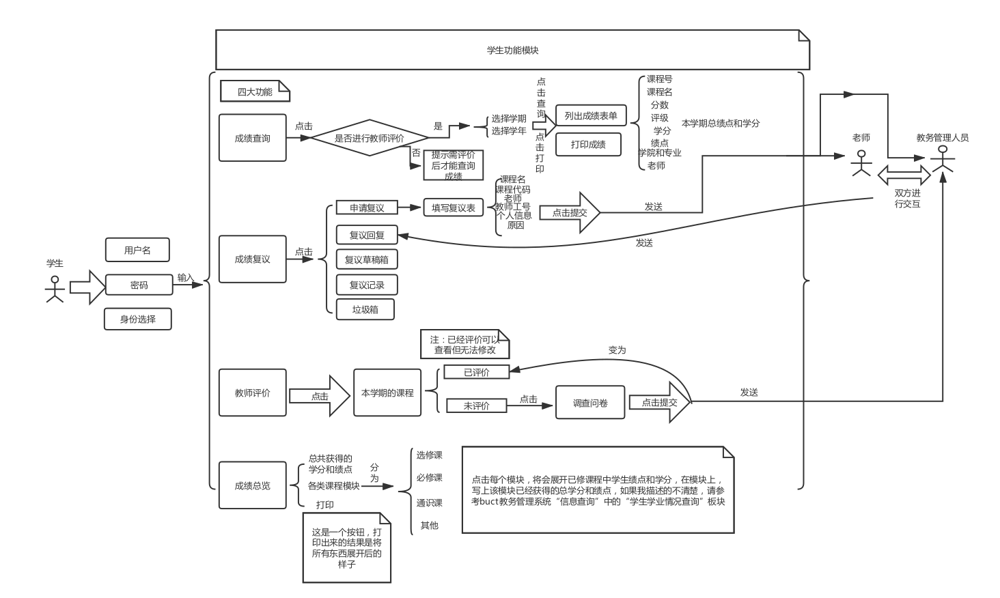
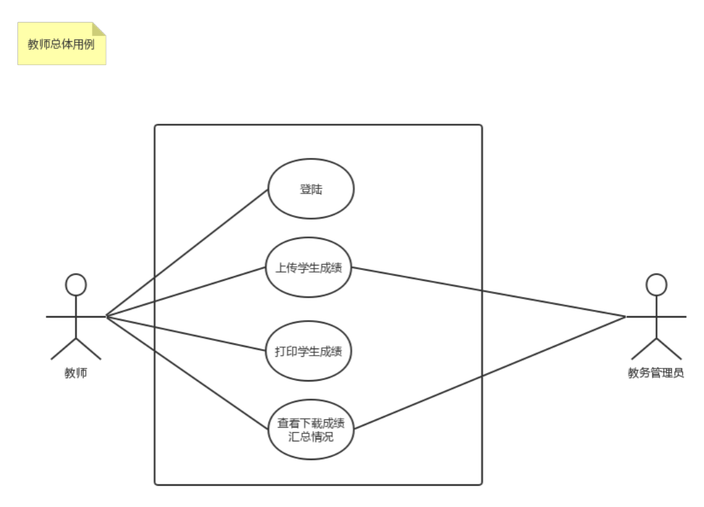
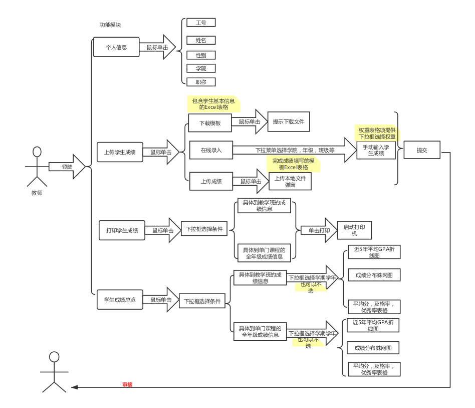
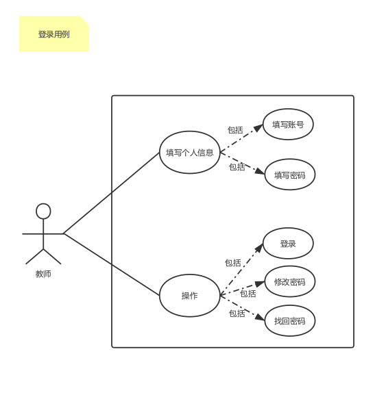
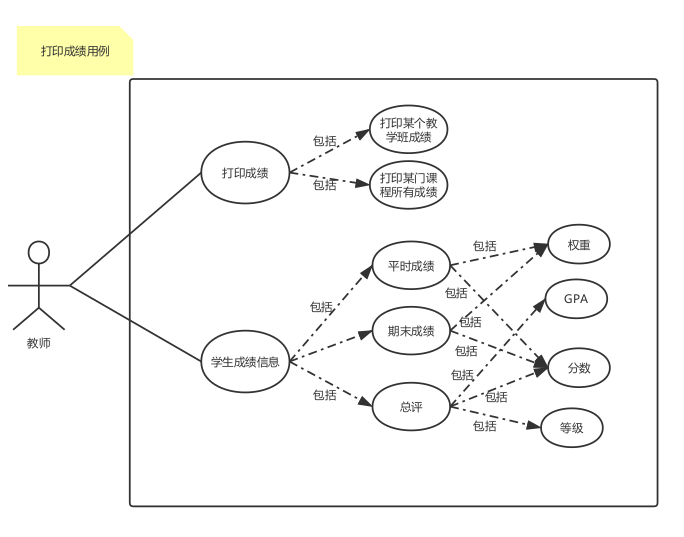
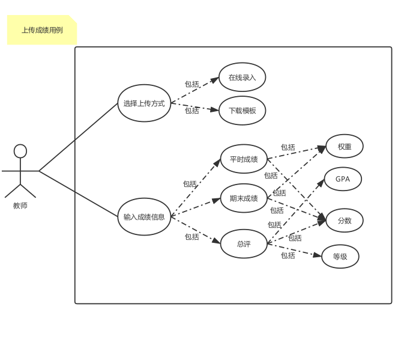
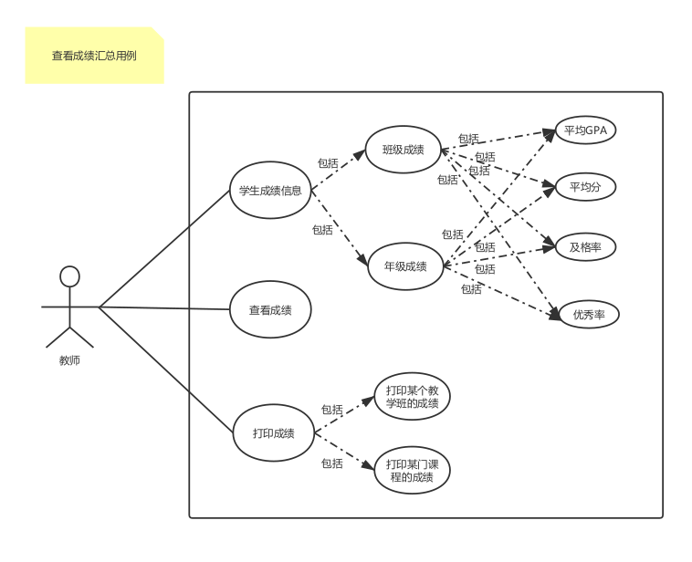
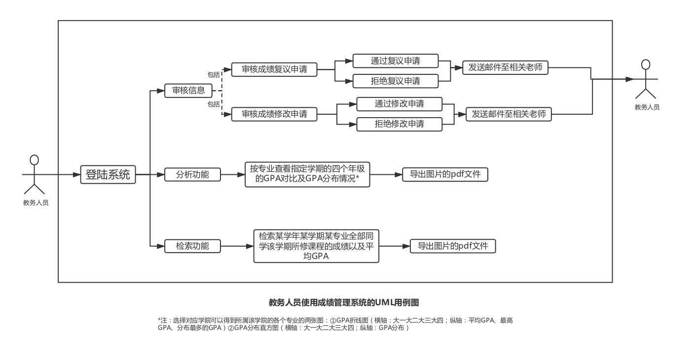
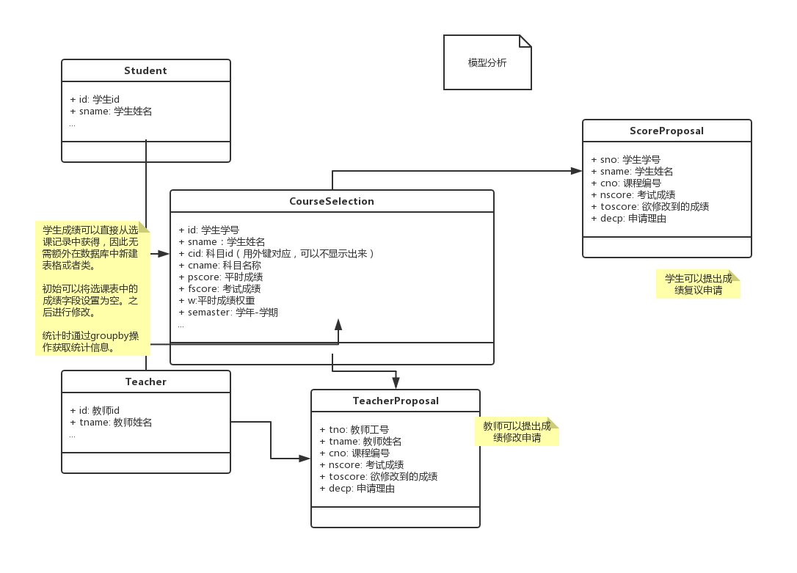

# 成绩管理子系统需求分析

## 用例图

### 学生用例分析

<!DOCTYPE html> <html lang="zh"> <head> <meta charset="utf-8"/> <title>Markdown在线编辑器 - www.MdEditor.com</title> <link rel="shortcut icon" href="https://www.mdeditor.com/images/logos/favicon.ico" type="image/x-icon"/> </head> <body><h1 id="h1-u5B66u751Fu7528u6237u793Au4F8B">学生用户示例</h1>
前提条件：学生的用户名和账号必须是正确的
 <h2 id="h2--1-">用例1：学生通过访问网站，查询某学期成绩，并打印出成绩单</h2>
参与者：学生 情境目标：学生查询到自己的成绩信息，打印成绩单 
<h3 id="h3--">场景：</h3><h4 id="h4-1-">1、学生访问到该网站，输入用户名，密码，选择学生身份，登录；</h4><h4 id="h4-2-">2、学生选择成绩查询功能；</h4><h4 id="h4-3-3-">3、如果学生已经完成教学评价，可以接着该用例往下走；如果未完成，看到提示后，进入用例3，完成教学评价；</h4><h4 id="h4-4-">4、网站中有学期和学年的选择框，有查询和打印两个按钮；</h4><h4 id="h4-5-">5、学生选择好学期和学年后，点击查询，网站中列出成绩单（课程号，课程名，任课老师，学院，专业，学分，分数，评级，绩点），成绩单中还有本学期总绩点的学分。</h4><h4 id="h4-6-">6、点击打印，预览后打印出成绩单；</h4><h2 id="h2--2-">用例2：学生通过访问网站，进行成绩复议</h2>
参与者：学生 情境目标：学生向学校申请成绩复议，并得到回复 
<h3 id="h3--">场景：</h3><h4 id="h4-1-">1、学生访问到该网站，输入用户名，密码，选择学生身份，登录；</h4><h4 id="h4-2-">2、学生选择成绩复议功能；</h4><h4 id="h4-3-">3、网站中出现几个小功能模块：</h4><h5 id="h5--1-">（1）申请复议：学生将新建一个成绩复议表单，按照表中提示填信息之后，可以提交给学校；</h5><h5 id="h5--2-">（2）复议回复：学生将再次看到自己收到的复议回复，未读和已读都有标记，学生可以查看和删除；</h5><h5 id="h5--3-">（3）复议草稿箱：学生未提交出去的成绩复议表单将保存在这里；</h5><h5 id="h5--4-">（4）复议记录：学生提交过的复议记录，有日期信息。学生可以查看和删除记录；</h5><h5 id="h5--5-">（5）垃圾箱：学生删除过的记录和表单都暂时保存在此，可以回收，删除，清空；</h5><h4 id="h4-4-">4、学生点击申请复议，填好信息，点击提交，提示成功，申请已经分别交给老师和教务人员。</h4><h4 id="h4-5-">5、一段时间后（这段时间教务人员和老师在交互），学生登录网站，在主页有消息提示，点击进入“复议回复”模块中可以查看。</h4><h2 id="h2--3-">用例3：学生通过网站，对本学期进行教学评价</h2>
参与者：学生 情境目标：学生在网站中完成教学评价，评价提交后不可更改 
<h3 id="h3--">场景：</h3><h4 id="h4-1-">1、学生访问到该网站，输入用户名，密码，选择学生身份，登录；</h4><h4 id="h4-2-">2、学生选择教学评价功能；</h4><h4 id="h4-3-">3、网站中条列出本学期的所有课程和老师，已评价的提供查看功能，未评价的点击评价进行问卷评价。</h4><h4 id="h4-4-">4、学生点击评价，填写好问卷调查。</h4><h4 id="h4-5-">5、问卷末尾，有确定，重填和提交三个按钮，确定用来固定答案，重填用来清空原来的填写，提交把问卷提交至教务管理人员处。</h4><h4 id="h4-6-">6、全部提交完成后，本项完成。</h4><h2 id="h2--4-">用例4：学生通过网站，查看大学成绩总体情况</h2>
参与者：学生 情境目标：学生在网站中完成查看自己的学业情况（已获得学分，总绩点等） 
<h3 id="h3--">场景：</h3><h4 id="h4-1-">1、学生访问到该网站，输入用户名，密码，选择学生身份，登录；</h4><h4 id="h4-2-">2、学生选择成绩总览功能；</h4><h4 id="h4-3-">3、网站前几行有总学分，总绩点，以及大学各类课程所修数量；</h4><h4 id="h4-4-">4、网站中出现几个统计模块，每个模块上显示该模块中课程数量，总学分，模块如下：</h4><h5 id="h5--1-2-3-4-">（1）必修课（2）选修课（3）通识课（4）其他课</h5><h4 id="h4--">点击模块展开相应类别的所有已修课程信息，包含课程名，课程代码，绩点，学分，评级；</h4><h4 id="h4-5-">5、点击打印按钮打印出所有模块和模块展开后的信息。</h4></body> </html>

### 教师用例分析

### 教务管理员用例分析

## UML类图

## View函数列表

| 函数名 | 完成功能 | 传入参数　| 返回值 |
| :---: | :---: | :---: | :---: |
| stu_search_score | 学生查看自己本学期的成绩，包括了考试总分和平时分等成绩明细 |
| stu_view_stat | 学生查看自己成绩的统计信息，包括已修学分和未修学分，成绩走势 |
| stu_proposal | 学生针对某一门课提交成绩复议申请，填写相应的表单。对应的申请会被同时发送到教务管理人员和教师处，需要教师确认同意或者不同意，教务处起到监管的作用|
|　stu_print_score | 学生打印自己的个人成绩　|
| stu_comment_tch | 学生对教师教学情况进行评价，填写相应的评教表单 |
| tch_upload_score_xls | 教师通过excel电子表格上传成绩　|
| tch_upload_score_online | 教师在线填写学生成绩　|
| tch_print_score | 教师打印自己教学班级的学生成绩信息　|
| tch_download_score | 教师下载学生成绩用于分析　|
| tch_proposal | 教师向教务处提出修改成绩申请　|
| get_xls_template | 根据教师所选条目，下载对应的填写和上传成绩的电子表格　|
| mg_view_proposal | 教务管理人员查看并且选择通过还是不通过学生和教师提出的修改成绩申请 |
| email_send | 在系统内发送email到对应的人员处，包括教务管理人员，教师，学生等 |
| get_xls_to_instructor | 汇总信息提交给专业辅导员(比如，计算机科学与技术的辅导员，通过调用该函数，获取到对应专业的学生各学科信息，结果需降序排列)　|
| cal_stu_gpa | 计算该学生本学期所有成绩加权的综合GPA（通过对应公式加权计算）|
| cal_total_gpa | 计算该学生自入学以来的个学期GPA汇总|
| get_stu_course_score | 获取到该学生某指定一门课程的成绩，传入参数课程名和学号，如果不存在需要抛出对应的异常　|
| get_class_mean | 获取对应教学班级的平均分| class_name|
| get_class_max | 获取教学班成绩最高分| class_name |
| get_class_excelent |获取教学班９０分以上的学生 | class_name | a set of students score > 90 |
| get_class_excelent_rat | 获取教学班优秀率| class_name | the exc_stu_num / total_stu_num_in_clas |
| get_major_gpa_mean |获取专业平均GPA，可以指定学期，默认是本学期，下同| major_id / major_name, semaster |
| get_major_gpa_max |获取专业最高GPA | major_id / major_name |
| get_major_gpa_mode |获取专业GPA众数 | major_id / major_name |
| get_major_failed | 获取该专业学位警告学生名单| major_id / major_name | a set of students failed to graduate(gpa < 2.0) |
| get_major_failed_rat | 获取本专业学位警告学生率|major_id / major_name |float|
| get_major_num | 获取专业人数　| major_id / major_name | int | 
| get_class_failed | 获取到该教学班未通过考试的学生| class_name | a set of students failed to pass the exam |
| get_class_failed_rat | 获取到该教学班未通过率| class_name | float |
| get_class_num | 获取教学班人数　| class_name | int |
| get_stu_in_range | 获取到成绩在指定范围内的的学生| score_range, score_type | a set of students in the range of score |
| table_to_pdf | 导出表格为pdf | | |
| send_annocement | 向指定用户发送通知 | user_id | |